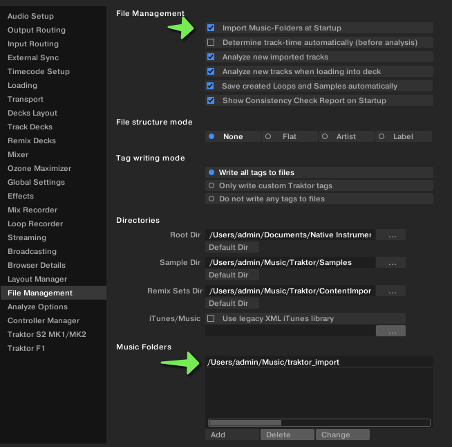
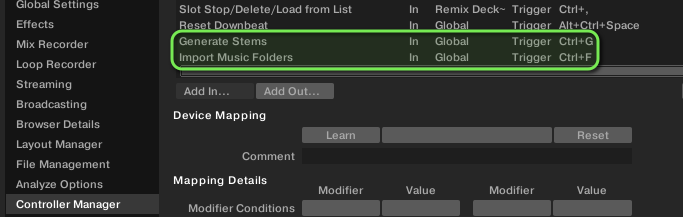
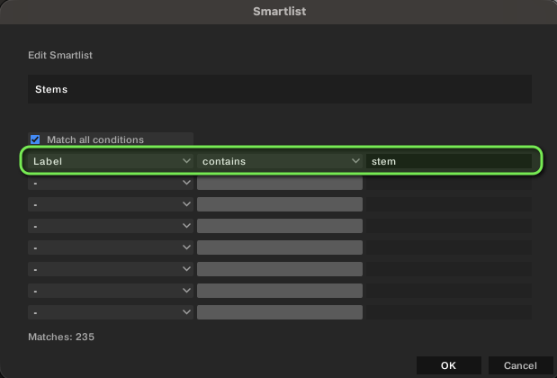
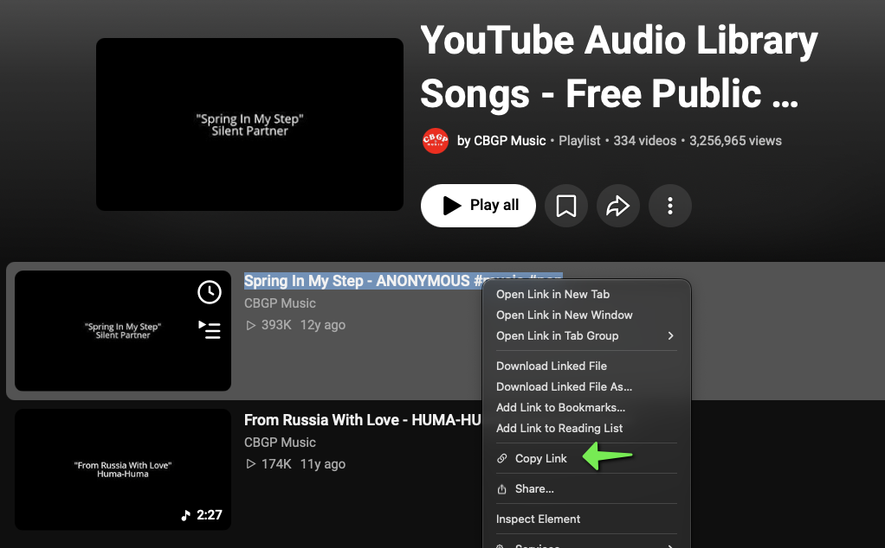
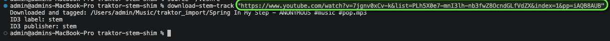
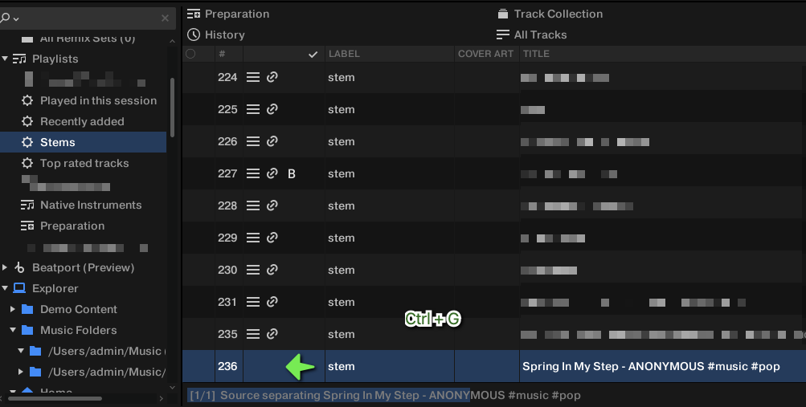
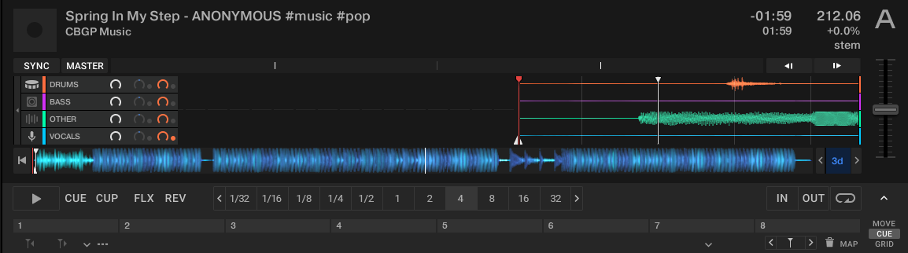

# Traktor Stem Shim

A small macOS shell automation  that downloads an MP3 from an authorized YouTube source, adds a `stem` metadata marker, and places the finished file in a Traktor import folder. Traktor stem generation is still started manually with the mapped `Ctrl+G` shortcut.

# Problem statement
Traktor introduced native stem separation in [Traktor Pro 4](https://www.native-instruments.com/en/products/traktor/dj-software/traktor-pro-4/), however it is currently implemented in a rather cumbersome way. There is no external tool/cli one can run to run stem separation against many files at once, or a bulk option "Separate All", like it does for the admittedly much lighter-weight Beatgrid/BPM/key Analyze option. This utilitity is meant to streamline this process as much as possible, while still requiring some human interaction.

## Use Only Authorized Downloads

Use this utility only for audio you own or are explicitly allowed to download, such as your own uploads, public-domain works, or content whose license/creator expressly permits downloading. Free to stream or watch does not necessarily mean free to download. Follow the creator's license and YouTube's terms.

## Install

Requires `yt-dlp`, `ffmpeg`, and `ffprobe`:

- [`yt-dlp`](https://github.com/yt-dlp/yt-dlp)
- [`FFmpeg`](https://github.com/FFmpeg/FFmpeg)
- [`ffprobe` source](https://github.com/FFmpeg/FFmpeg/blob/master/fftools/ffprobe.c) (included with FFmpeg)

```sh
sh install.sh
source "$HOME/.zshrc"
command -v download-stem-track
```

## Usage

```sh
download-stem-track "YOUTUBE_URL"
download-stem-track --title "Preferred Track Title" "YOUTUBE_URL"
download-stem-track --output-dir "$HOME/Music/Traktor Inbox" "YOUTUBE_URL"
```

The default destination is `$HOME/Music/traktor_import`. A YouTube watch URL is reduced to its `v` parameter, dropping other query parameters such as playlist and timestamp values. The utility downloads one item, converts it to high-quality MP3, preserves existing publisher metadata, adds the custom ID3 `label=stem` marker, and refuses to overwrite a file already in the destination.

## Traktor Setup

1. In Traktor's File Management preferences, add `$HOME/Music/traktor_import` to **Music Folders**. Use the **Import Music Folders** action, or bind the action you found to an unused keyboard shortcut such as `Ctrl+F` if Controller Manager offers it. Confirm the new track appears in the collection without restarting Traktor.
	

2. In Controller Manager, map **Import Music Folders** to `Ctrl+F` and **Generate Stems** to `Ctrl+G`.
	

3. Create or use a smart playlist with the rule `Label contains stem`.
	
    
4. Confirm imported tracks have `stem` in the Label column. The script writes a custom ID3 label field, but Traktor's import of that field has not yet been verified. If the Label is blank, set it in Traktor and add the track to the collection; the smart playlist depends on the collection's Label value.

## Typical Workflow

1. Find a track you are authorized to download on YouTube and copy its link.
    
    
2. Press `Cmd+1` to open your terminal, or whatever hotkey you use to open a terminal.
3. Run `download-stem-track "<copied-link>"`. Keep the double quotes around the full link; they prevent shell-special characters such as `&` from being treated as separate commands.
	

4. Switch to Traktor and press `Ctrl+F` to run **Import Music Folders**. The new track should appear in the collection.
	

5. Open the **Stems** smart playlist. Find tracks whose Label is `stem` and which do not yet show the stem icon. Select those tracks and press `Ctrl+G` to queue stem generation.
6. Once processing finishes, load the track into a deck to see and control its separated stems.
	


The script only downloads, tags, and stages the file. It does not rescan Traktor's folders, edit Traktor's collection database, or invoke keyboard shortcuts.
